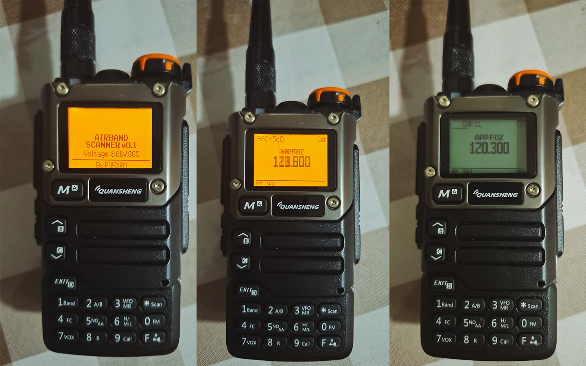

<div align="center">

# 📻 QAP — Quansheng Airband Project

**Firmware RX-only para o Quansheng UV-K5(8) dedicado a escutar o tráfego aéreo**


**QAP** = **Q**uansheng **A**irband **P**roject · **Indicativo:** PU5XRM

**🌐 [Read this README in English](./README.md)**



*Da esquerda para a direita: **ligando**, **escaneando** e **hold**.*

</div>

---

Transforme seu **Quansheng UV-K5(8)** em um **scanner de aviação dedicado**, focado exclusivamente na faixa **118–136 MHz (AM)** — torre (TWR), aproximação (APP), rota (ACC), ATIS, solo (GND) e emergência 121.500 MHz.

- 🎧 **Recepção AM dedicada** em 118.000–136.975 MHz, com passos de **8.33 / 25 kHz**;
- 📡 **AM AGC avançado** (32 níveis, histerese 3 dB) — áudio limpo de aeronaves próximas ou em solo;
- 🔊 **Filtro DSP passa-banda 300–3400 Hz** — realça a voz em comunicações ATC;
- 🔇 **Squelch baseado em SNR**, não em RSSI — correto para AM (portadora sempre presente);
- 🔄 **Scan inteligente** com dwell otimizado para ATC e canais de prioridade (TWR/APP);
- 🖥️ **Interface limpa e dedicada** no display ST7565 128×64 (fonte grande de frequência, sem poluição visual);
- 🛠️ **Ferramenta web (Web Serial)** para configurar scanlists, backup de EEPROM e atualizar firmware.

## 📋 Sumário

- [Hardware Alvo](#-hardware-alvo)
- [Funcionalidades](#-funcionalidades)
- [Instalação — Flashear o Rádio](#-instalação--flashear-o-rádio)
- [Ferramenta Web](#-ferramenta-web)
- [Build do Firmware](#-build-do-firmware)
- [Estrutura do Repositório](#-estrutura-do-repositório)
- [Documentação](#-documentação)
- [Downloads](#-downloads)
- [Licença e Créditos](#-licença-e-créditos)

## 🖥️ Hardware Alvo

| Item | Especificação |
|------|--------------|
| Rádio | Quansheng **UV-K5(8)** (e variantes compatíveis) |
| Chip RF | **BK4819** (recepção 18 MHz – 1.3 GHz) |
| MCU | DP32G030 (ARM Cortex-M0, 64 KB flash) |
| Display | ST7565 **128×64** (8 páginas de 8 px) |
| Faixa alvo | **118.000 – 136.975 MHz** |
| Modulação | **AM** |
| Passo | 8.33 kHz / 25 kHz |

## ⚙️ Funcionalidades

### ✅ Incluídas
- Recepção AM na faixa aeronáutica completa;
- Scan rápido com dwell time otimizado para ATC;
- AM AGC avançado (32 níveis com histerese de 3 dB);
- Filtro DSP de áudio passa-banda (300–3400 Hz);
- Squelch baseado em SNR (otimizado para AM);
- Tabela de ganho calibrada para airband;
- Canais de prioridade (TWR/APP);
- S-meter / indicador RSSI;
- Scan lists (`1/2/3/ALL`) configuráveis;
- Modo tri-frequência e tecla PTT remapeada.

### 🗑️ Removidas (para liberar flash)
- **Transmissão (TX)** — completamente desabilitada no hardware;
- FM broadcast, NOAA, VOICE/Beep;
- DTMF calling/paging, AIRCOPY (clone RF);
- VOX, Alarm e outras funções não relacionadas à aviação.

> Isso libera **~23–30 KB** de flash para os algoritmos de recepção AM.

## 🔌 Instalação — Flashear o Rádio

### 1. Baixe o firmware
Faça o download do binário mais recente na seção **[Releases](https://github.com/romildodcm/qap/releases)** (arquivo `...-firmware.packed.bin`).

### 2. Faça backup do firmware original
Use a **[ferramenta web](#-ferramenta-web)** ou um flasher para **salvar o firmware de fábrica** antes de qualquer gravação. Você precisará dele para restaurar o rádio.

### 3. Grave com o Web Flasher
Use o [web flasher](https://egzumer.github.io/uvtools) (Chrome/Edge via Web Serial) com o arquivo `.packed.bin` baixado.

### 4. Ligue e escute
Pronto — o rádio inicia direto em modo scanner airband.

> ⚠️ Use um **cabo de dados** de qualidade. Uma gravação interrompida pode exigir recuperação via DFU.

## 🛠️ Ferramenta Web

Configuração e backup rodam **direto no navegador** — sem instalar nada:

- **Página:** [`https://qap.romildo.net/`](https://qap.romildo.net/) · (mirror: `https://romildodcm.github.io/qap/`)

| Recurso | Descrição |
|---------|-----------|
| **Scan Lists** | Abas `1/2/3`, edição de frequência + nome, enviar/ler do rádio, exportar/importar CSV |
| **Backup do rádio** | Dump completo da EEPROM |
| **Firmware** | Backup (leitura) e atualização (flash via modo DFU) |

> Requer navegador com **Web Serial API** (Chrome/Edge) e cabo de dados.

## 🔨 Build do Firmware

O código-fonte C fica em [`firmware/src/`](./firmware/src/). O build é feito com **Docker** (funciona em macOS Intel/Apple Silicon e Linux).

### Compilar com Docker (recomendado)
```bash
cd firmware
docker build -t uvk5-build .
docker run --rm -v "$PWD:/app" -w /app uvk5-build /bin/sh -c "make clean && make"
```

### Compilar nativo
Requisitos: `arm-none-eabi-gcc` + `python3` com `crcmod`.
```bash
cd firmware
make clean && make
```

O binário de gravação sai em `firmware/build/firmware.packed.bin` (flash < 64 KB, zero warnings com `-Werror`).

> 🔍 Guia completo de build + release em [`docs/build-release.md`](./docs/build-release.md).

## 📁 Estrutura do Repositório

```
qap/
├── firmware/          # Firmware (fonte C, Makefile, Dockerfile)
│   └── src/           #   Código-fonte (drivers BK4819, UI, scan, AGC…)
├── tools/             # Ferramenta web (ui_editor.html — Web Serial)
├── docs/              # Arquitetura, UI, frequências airband BR
├── plans/             # Planos de implementação (roadmap)
├── CHANGELOG.md       # Histórico de builds
├── CNAME              # Domínio qap.romildo.net
├── LICENSE            # Apache 2.0
└── NOTICE             # Créditos aos projetos base
```

## 📚 Documentação

| Documento | Conteúdo |
|-----------|----------|
| [`docs/arquitetura.md`](./docs/arquitetura.md) | Decisões técnicas, BK4819, balanço de flash |
| [`docs/ui-design.md`](./docs/ui-design.md) | Especificação da interface ST7565 128×64 |
| [`docs/frequencias-airband-brasil.md`](./docs/frequencias-airband-brasil.md) | Frequências ATC Brasil (TWR/APP/ACC) + scan sugerido |
| [`CHANGELOG.md`](./CHANGELOG.md) | Histórico de builds com hash e binário datado |

## 📥 Downloads

Cada build publica um **binário datado** com hash sha256 na seção Releases:

- **Build atual (2026-08-16):** `20260816T21h08-firmware.packed.bin`
- **Hash:** `0054e37e2fee0c2c80f99567e39d9f81c7702b481dff2efd55f97f7886a2614c`
- **Tamanho:** 51.938 bytes (flash < 64 KB ✓)

Link direto do release mais recente:
```
https://github.com/romildodcm/qap/releases/latest/download/firmware.packed.bin
```

## ⚖️ Licença e Créditos

Distribuído sob **Apache License 2.0** — veja [`LICENSE`](./LICENSE) e [`NOTICE`](./NOTICE).

Fork baseado em:
- [DualTachyon](https://github.com/DualTachyon/uv-k5-firmware) — implementação original;
- [OneOfEleven](https://github.com/OneOfEleven/uv-k5-firmware-custom);
- [egzumer](https://github.com/egzumer/uv-k5-firmware-custom);
- [Armel/F4HWN](https://github.com/armel/uv-k5-firmware-custom);
- [miramir/uv-k5-firmware](https://github.com/miramir/uv-k5-firmware) — base deste fork.

---

<div align="center">

**QAP — Quansheng Airband Project** · Recepção de aviação com o UV-K5 · **PU5XRM**

*Este projeto é somente para escuta. Não transmite em frequências aeronáuticas — é ilegal e perigoso.*

</div>
