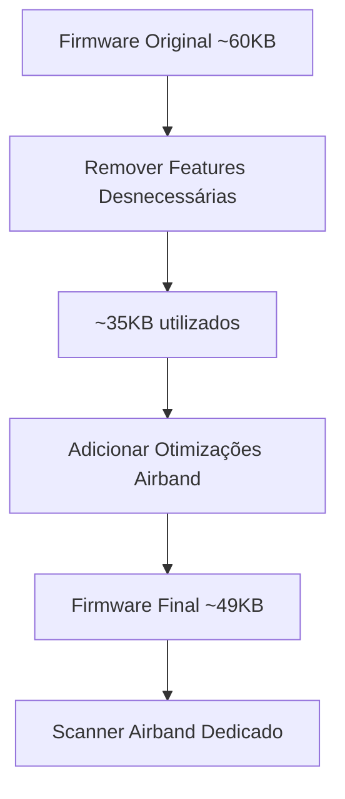
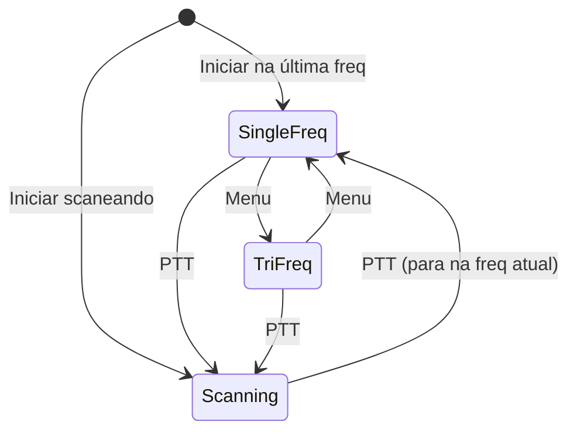

# Arquitetura e Decisões Técnicas

## Sumário
- [Arquitetura e Decisões Técnicas](#arquitetura-e-decisões-técnicas)
  - [Sumário](#sumário)
  - [1. Visão Geral](#1-visão-geral)
  - [2. Chip BK4819 — Capacidades e Limitações](#2-chip-bk4819--capacidades-e-limitações)
    - [Registradores relevantes para AM/Airband](#registradores-relevantes-para-amairband)
  - [3. Balanço de Flash](#3-balanço-de-flash)
    - [Espaço liberado (features removidas)](#espaço-liberado-features-removidas)
    - [Espaço necessário (otimizações)](#espaço-necessário-otimizações)
  - [4. Otimizações de Recepção AM](#4-otimizações-de-recepção-am)
    - [4.1 AM AGC Avançado](#41-am-agc-avançado)
    - [4.2 Filtro DSP de Áudio](#42-filtro-dsp-de-áudio)
    - [4.3 Squelch AM/SNR](#43-squelch-amsnr)
    - [4.4 Scan Inteligente](#44-scan-inteligente)
    - [4.5 Tabela de Ganho Airband](#45-tabela-de-ganho-airband)
  - [5. Modos de Operação e Controle](#5-modos-de-operação-e-controle)
    - [5.1 Modos de Escuta](#51-modos-de-escuta)
    - [5.2 Tri-frequência — Implementação](#52-tri-frequência--implementação)
    - [5.3 Tecla PTT Remapeada](#53-tecla-ptt-remapeada)
    - [5.4 Comportamento de Inicialização](#54-comportamento-de-inicialização)
    - [5.5 Gestão da Lista de Scan](#55-gestão-da-lista-de-scan)
  - [6. Limitações de Hardware](#6-limitações-de-hardware)
  - [7. Referências](#7-referências)

## 1. Visão Geral

O objetivo é criar um firmware para o Quansheng UV-K5(8) que opere **exclusivamente como scanner airband** (118–136 MHz, AM). Toda a lógica de transmissão é removida, e o espaço de flash liberado é utilizado para algoritmos que melhorem a qualidade de recepção AM.



## 2. Chip BK4819 — Capacidades e Limitações

O BK4819 é um transceptor integrado single-chip com:

| Parâmetro | Valor |
|-----------|-------|
| Faixa RX | 18 MHz – 1300 MHz |
| Demodulação | FM/AM |
| IF bandwidth | Configurável via registrador |
| AGC | Hardware básico + controle via firmware |
| RSSI | Leitura via registrador (REG_67) |
| Sensibilidade AM típica | -107 dBm (com AM fix) |

### Registradores relevantes para AM/Airband

| Registrador | Função |
|-------------|--------|
| REG_10 | Ganho RX (LNA, MIXER, PGA) |
| REG_11 | Ganho IF |
| REG_13 | Configuração AGC/AM |
| REG_43 | Configuração AM demodulator |
| REG_67 | Leitura RSSI |
| REG_7E | Filtro de áudio |

## 3. Balanço de Flash

### Espaço liberado (features removidas)

| Feature | Flash estimado |
|---------|---------------|
| TX completo (modulador, PA control, power cal) | ~8–12 KB |
| FM broadcast receiver | ~3–4 KB |
| NOAA | ~2 KB |
| VOICE/Beep synthesis | ~4–6 KB |
| DTMF calling/paging | ~3 KB |
| AIRCOPY (clone RF) | ~2 KB |
| VOX | ~1 KB |
| Alarm | ~0.5 KB |
| **Total liberado** | **~23–30 KB** |

### Espaço necessário (otimizações)

| Otimização | Flash estimado |
|------------|---------------|
| AM AGC avançado (32 níveis) | ~3 KB |
| Filtro DSP áudio (IIR biquad) | ~5 KB |
| Squelch AM baseado em SNR | ~2 KB |
| Scan inteligente com prioridade | ~3 KB |
| Gain table calibrada airband | ~1 KB |
| Modos de operação + tri-freq | ~2 KB |
| Gestão de lista + persistência EEPROM | ~1.5 KB |
| **Total otimizações** | **~17.5 KB** |

**Saldo: ~5.5–12.5 KB livres** para futuras melhorias.

## 4. Otimizações de Recepção AM

### 4.1 AM AGC Avançado

O AM fix original (OneOfEleven) ajusta ganho em ~8 degraus discretos. Com mais flash disponível, implementar AGC com:

- **32 níveis de ganho** (transições mais suaves);
- **Histerese de 3 dB** (evita oscilação entre níveis);
- **Attack time: 5 ms** (resposta rápida a sinais fortes);
- **Decay time: 200 ms** (liberação gradual).

```c
#define AM_AGC_LEVELS          32
#define AM_AGC_HYSTERESIS_DB   3
#define AM_AGC_ATTACK_MS       5
#define AM_AGC_DECAY_MS        200

typedef struct {
    uint8_t  current_level;
    uint16_t gain_table[AM_AGC_LEVELS];
    int16_t  rssi_thresholds[AM_AGC_LEVELS];
    uint32_t last_change_tick;
} am_agc_state_t;

void am_agc_update(am_agc_state_t *state, int16_t rssi_dbm) {
    int16_t target = rssi_to_level(rssi_dbm);
    int16_t diff = target - state->current_level;

    if (abs(diff) < AM_AGC_HYSTERESIS_DB)
        return;

    uint32_t elapsed = tick_ms() - state->last_change_tick;
    uint32_t time_const = (diff > 0) ? AM_AGC_ATTACK_MS : AM_AGC_DECAY_MS;

    if (elapsed >= time_const) {
        state->current_level += (diff > 0) ? 1 : -1;
        apply_gain(state->gain_table[state->current_level]);
        state->last_change_tick = tick_ms();
    }
}
```

**Resultado esperado:** Menos distorção/clipping em sinais AM fortes (aeronaves próximas ou em solo), transições suaves sem "pops" de áudio.

### 4.2 Filtro DSP de Áudio

Filtro IIR biquad passa-banda otimizado para voz humana em comunicação aeronáutica:

- **Banda passante:** 300 Hz – 3400 Hz
- **Tipo:** Butterworth 2ª ordem (cascata de 2 biquads)
- **Fs:** 8 kHz (taxa de amostragem do BK4819)

```c
typedef struct {
    float b0, b1, b2, a1, a2;
    float x1, x2, y1, y2;
} biquad_t;

static biquad_t hp_filter;  // High-pass 300 Hz
static biquad_t lp_filter;  // Low-pass 3400 Hz

int16_t audio_filter(int16_t sample) {
    float x = (float)sample;
    // High-pass 300 Hz
    float y_hp = hp_filter.b0 * x
               + hp_filter.b1 * hp_filter.x1
               + hp_filter.b2 * hp_filter.x2
               - hp_filter.a1 * hp_filter.y1
               - hp_filter.a2 * hp_filter.y2;
    hp_filter.x2 = hp_filter.x1;
    hp_filter.x1 = x;
    hp_filter.y2 = hp_filter.y1;
    hp_filter.y1 = y_hp;

    // Low-pass 3400 Hz
    float y_lp = lp_filter.b0 * y_hp
               + lp_filter.b1 * lp_filter.x1
               + lp_filter.b2 * lp_filter.x2
               - lp_filter.a1 * lp_filter.y1
               - lp_filter.a2 * lp_filter.y2;
    lp_filter.x2 = lp_filter.x1;
    lp_filter.x1 = y_hp;
    lp_filter.y2 = lp_filter.y1;
    lp_filter.y1 = y_lp;

    return (int16_t)y_lp;
}
```

> **Nota:** O Cortex-M0 não tem FPU. Na implementação real, usar aritmética de ponto fixo (Q15 ou Q31) para performance aceitável.

### 4.3 Squelch AM/SNR

O squelch padrão usa nível RSSI, inadequado para AM (portadora sempre presente). Implementação baseada em estimativa de SNR:

```c
#define AM_SQUELCH_SNR_OPEN_DB   10
#define AM_SQUELCH_SNR_CLOSE_DB   7
#define NOISE_FLOOR_SAMPLES      16

typedef struct {
    int16_t noise_floor_db;
    int16_t signal_peak_db;
    bool    is_open;
} am_squelch_state_t;

bool am_squelch_check(am_squelch_state_t *sq, int16_t rssi_db) {
    // Estimar noise floor como média das leituras mais baixas
    update_noise_floor(sq, rssi_db);

    int16_t snr = rssi_db - sq->noise_floor_db;

    if (!sq->is_open && snr >= AM_SQUELCH_SNR_OPEN_DB) {
        sq->is_open = true;
    } else if (sq->is_open && snr < AM_SQUELCH_SNR_CLOSE_DB) {
        sq->is_open = false;
    }

    return sq->is_open;
}
```

### 4.4 Scan Inteligente

Otimizado para o padrão de comunicação ATC (transmissões curtas, 2–10 segundos):

```c
#define SCAN_DWELL_MS           90    // Tempo mínimo em cada canal (padrão IJV)
#define SCAN_HOLD_MS          3000    // Mantém no canal após sinal
#define SCAN_RESUME_DELAY_MS  2000    // Espera antes de retomar scan
#define PRIORITY_REVISIT_RATIO   3    // Canais prioritários 3x mais

typedef struct {
    uint32_t freq_hz;
    uint8_t  priority;       // 0=normal, 1=alta (TWR/APP)
    uint16_t activity_score; // Histórico de atividade
} scan_channel_t;
```

Funcionalidades do scan:
- **Dwell adaptativo:** canais com histórico de atividade recebem mais tempo;
- **Canais de prioridade:** TWR e APP local revisitados com frequência 3x maior;
- **Resume inteligente:** após perder sinal, espera 2s (piloto pode responder);
- **Passo 8.33 kHz:** padrão ICAO moderno (25 kHz como fallback).

### 4.5 Tabela de Ganho Airband

LUT específica para 118–136 MHz ao invés da curva genérica:

```c
// Valores de REG_10 otimizados para airband
// Calibrados para maximizar dynamic range em 118-136 MHz
static const uint16_t airband_gain_lut[32] = {
    0x0000, 0x0008, 0x0010, 0x0018,  // Ganho mínimo (sinais fortes)
    0x0020, 0x0028, 0x0030, 0x0038,
    // ... valores intermediários ...
    0x00F0, 0x00F8, 0x0100, 0x0108,  // Ganho máximo (sinais fracos)
    // ... (32 entradas total)
};
```

## 5. Modos de Operação e Controle

### 5.1 Modos de Escuta

O firmware opera em 3 modos, selecionáveis via menu:



| Modo | Tela | Comportamento |
|------|------|---------------|
| Frequência única | 1 freq + S-meter grande | Escuta fixa em 1 canal |
| Scan | Freq atual + lista rolando | Percorre lista, para ao detectar sinal |
| Tri-frequência | 3 freqs + indicadores | Monitora 3 canais, áudio do que tiver sinal |

### 5.2 Tri-frequência — Implementação

O BK4819 é single-channel, então o modo tri-frequência usa time-slicing rápido:

```c
#define TRI_FREQ_SLOTS       3
#define TRI_FREQ_SLICE_MS   25  // 25ms por slot = ciclo de 75ms

typedef struct {
    uint32_t freqs[TRI_FREQ_SLOTS];
    int16_t  rssi[TRI_FREQ_SLOTS];
    uint8_t  active_slot;        // Slot com sinal detectado (prioridade)
    bool     signal_present[TRI_FREQ_SLOTS];
} tri_freq_state_t;

void tri_freq_tick(tri_freq_state_t *state) {
    // Se algum slot tem sinal, fica nele (não rotaciona)
    for (uint8_t i = 0; i < TRI_FREQ_SLOTS; i++) {
        if (state->signal_present[i]) {
            state->active_slot = i;
            return;
        }
    }
    // Nenhum sinal: rotaciona para próximo slot
    state->active_slot = (state->active_slot + 1) % TRI_FREQ_SLOTS;
    bk4819_set_frequency(state->freqs[state->active_slot]);
}
```

### 5.3 Tecla PTT Remapeada

Com TX desabilitado, o PTT vira controle de scan:

| Estado atual | Ação do PTT |
|-------------|-------------|
| Parado em freq fixa | Inicia scan |
| Scaneando | Para e permanece na frequência atual |

### 5.4 Comportamento de Inicialização

Configurável via menu, persistido em EEPROM:

| Opção | Descrição |
|-------|-----------|
| `STARTUP_SCAN` | Liga e começa a scanear a lista imediatamente |
| `STARTUP_LAST` | Liga na última frequência usada, modo fixo |

```c
typedef enum {
    STARTUP_SCAN,  // Inicia scaneando
    STARTUP_LAST,  // Retoma última frequência
} startup_mode_t;

typedef struct {
    startup_mode_t mode;
    uint32_t       last_freq_hz;
    uint8_t        last_op_mode;  // single/scan/tri
} persistent_config_t;
```

### 5.5 Gestão da Lista de Scan

Via menu, o operador pode:
- Adicionar a frequência atual à lista de scan;
- Remover frequência da lista;
- Definir prioridade (normal / alta);
- Atribuir label ao canal (ex: "TWR SBGR").

## 6. Limitações de Hardware

Independentemente das otimizações de firmware, estas limitações persistem:

| Limitação | Causa | Impacto |
|-----------|-------|---------|
| Sem filtro SAW/bandpass | Front-end wide-open | Intermodulação em RF intenso |
| Imagem de IF não rejeitada | Sem filtro de imagem | Sinais espúrios possíveis |
| Dynamic range limitado | ADC e mixer do BK4819 | Saturação perto de transmissores |
| Ruído de fase do PLL | Oscilador local integrado | Piso de ruído elevado |
| Sem rejeição de frequência vizinha | IF bandwidth fixo | Bleed de canais adjacentes |

**Expectativa realista:** O firmware otimizado tornará o rádio um scanner airband *funcional e usável* para monitoramento casual (aeroporto, aviação geral), mas não substituirá um scanner dedicado (Uniden SDS100, AOR AR-DV1) para uso crítico.

## 7. Referências

- [BK4819 Datasheet (reverse-engineered)](https://github.com/ludwich66/Quansheng_UV-K5_Wiki/wiki/BK4819)
- [DualTachyon — Firmware original RE](https://github.com/DualTachyon/uv-k5-firmware)
- [OneOfEleven — AM fix implementation](https://github.com/OneOfEleven/uv-k5-firmware-custom)
- [egzumer — Custom firmware](https://github.com/egzumer/uv-k5-firmware-custom)
- [miramir — Fork IJV-inspired](https://github.com/miramir/uv-k5-firmware)
- [ICAO Annex 10 — Frequency spacing 8.33 kHz](https://www.icao.int/)
